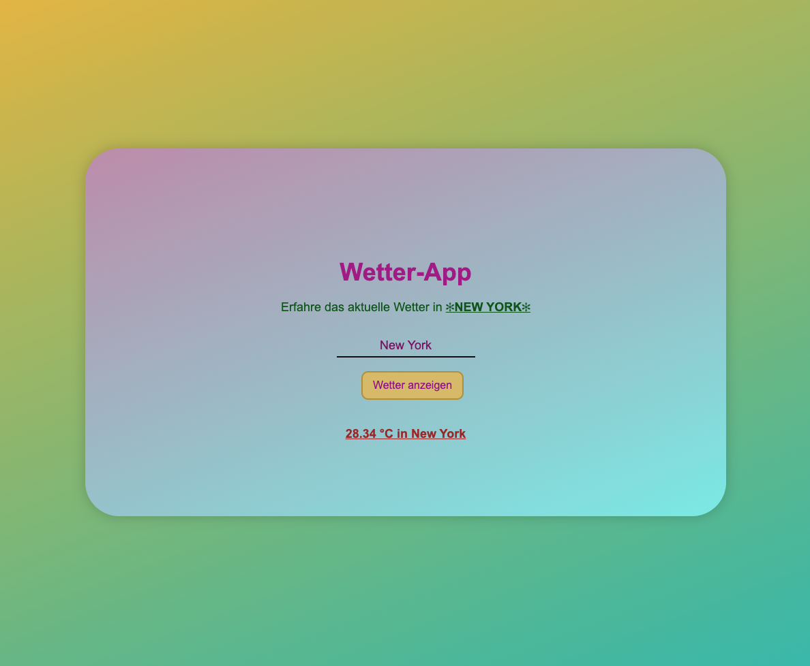

# 🌦️ Vue Weather App

Ein einfaches und modernes Wetter-Frontend, entwickelt mit **Vue 3** und **Vite**.  
Die App zeigt aktuelle Wetterdaten übersichtlich an – schnell und elegant umgesetzt.


# 🖼️ Vorschau


---

## 🛠️ Projekt Setup

### 📦 Abhängigkeiten installieren

```bash
npm install
npm run dev
npm run build
