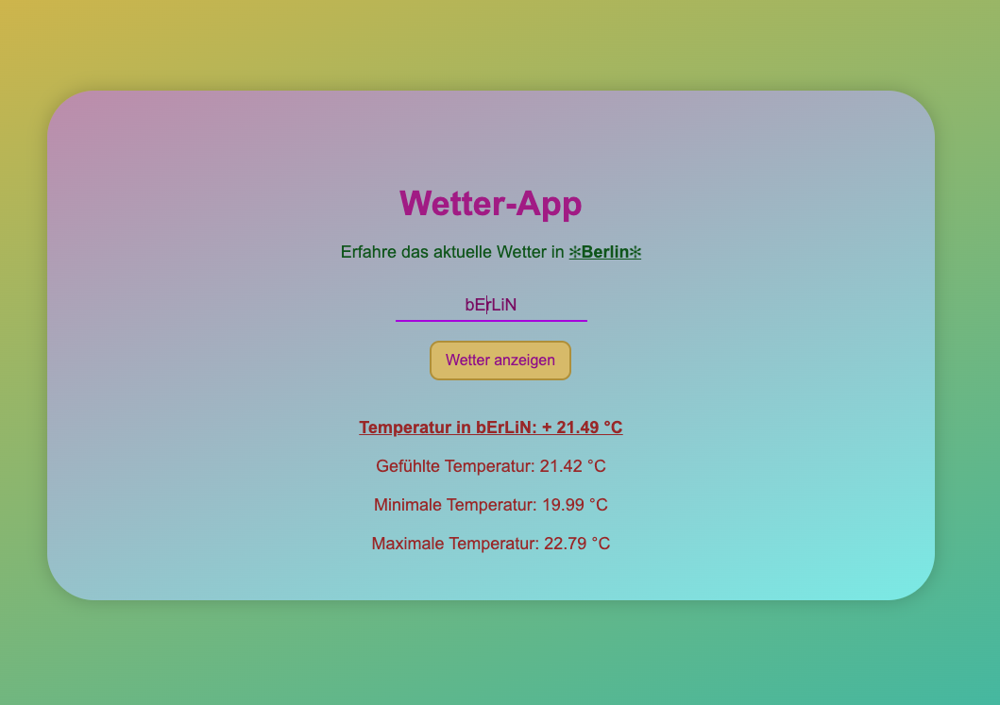

# 🌦️ Vue Weather App

Ein einfaches und modernes Wetter-Frontend, entwickelt mit **Vue 3** und **Vite**.  
Die App zeigt aktuelle Wetterdaten übersichtlich an – schnell und elegant umgesetzt.


# 🖼️ Vorschau



# 🔍 Funktion & Aufbau
In dieser App wird die [OpenWeatherMap API](https://openweathermap.org/current#name) verwendet, um das aktuelle Wetter anhand des Stadtnamens abzufragen.

Sobald eine Stadt eingegeben wird, zeigt die App:

🌡️ aktuelle Temperatur

🤒 gefühlte Temperatur

📉 minimale Temperatur

📈 maximale Temperatur

Der eingegebene Stadtname wird automatisch formatiert – der erste Buchstabe ist groß, der Rest klein –, unabhängig davon, wie der Benutzer ihn eingibt.


## ⚙️ Verwendete Technologien & Konzepte

- **Vue 3** mit **Vite** als Build-Tool  
- `data()` – zur Verwaltung von Zuständen (`city`, `error`, `info`)  
- `computed()` – für formatierte Werte wie `formattedCityName`, Temperaturtexte  
- `methods` – mit der Funktion `getWeather()` zum Abrufen der Wetterdaten  
- `setTimeout()` – zur temporären Anzeige von Fehlermeldungen  
- `axios` – für API-Requests an OpenWeatherMap  
- Direktiven wie `v-model`, `v-if`, `v-else`, `v-show` – für dynamisches DOM-Verhalten  
- `scoped` CSS – für gekapselte, komponentenspezifische Styles  

---

## 🛠️ Projekt Setup

### 📦 Abhängigkeiten installieren

```bash
npm install
npm run dev
npm run build
